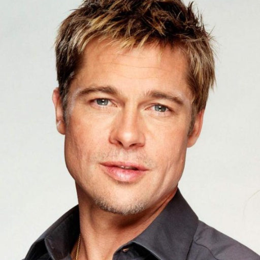

# Multimodal_Style_Transfer
Image Style Transfer with style comes from text description(CPU friendly).

## TODO ideas

()  Style comes from text description

()  Style comes from anothor image(classic style transfer)

()  Style comes from audio description

()  Real-time Transfer

## Setup

#### You are recommended to create a virtual envirnment with conda

```shell script
conda create --name StyleTransfer --file requirement.txt
```

##### If failed, You can also setup virtual envirnment step by step

```shell script
conda create -n StyleTransfer python=3.10

conda activate StyleTransfer
```

##### Then download the necessary Python packages through

```shell script
pip install -r requirement.txt
```

## Run

#### Run StyleTransfer with

```shell script
python transfer.py --content_path <content_img_file_path> --text <style_description> --output_path <target_img_storage_path> --exp_name <exp_name>
```

#### Of course you can just simply start and adjust parameters in code

```
python transfer.py
```

And here are examples for what it would look like if you use `Van_Gogh_Horus` as text description.

Content          |  Target
:-------------------------:|:-------------------------:
  |  

Hopefully you will like it.


## Have some fun

#### After obtaining the authorization from 'victim', we generated the following image with alias from JOJO.

|   Content     |   Crazy diamond   |   Golden experience   |   Star Platinum   |
:---------------:|:-------------------:|:-----------------------:|:-------------------:
   |       |       |   

## Reference

[Gatys et al., 2016 Gatys, L. A., Ecker, A. S., & Bethge, M. (2016). Image style transfer using convolutional neural networks. Proceedings of the IEEE conference on computer vision and pattern recognition (pp. 2414–2423).](https://www.cv-foundation.org/openaccess/content_cvpr_2016/papers/Gatys_Image_Style_Transfer_CVPR_2016_paper.pdf)

[DIVE INTO DEEP LEARNING (14.12. Neural Style Transfer)](https://d2l.ai/chapter_computer-vision/neural-style.html)

[CLIPstyler: Image Style Transfer with a Single Text Condition](https://arxiv.org/abs/2112.00374)

[StyleCLIP: Text-Driven Manipulation of StyleGAN Imagery](https://arxiv.org/abs/2103.17249)